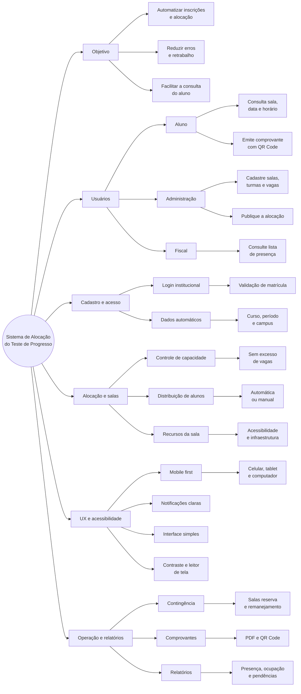

---

```mermaid
flowchart LR
    TP((Sistema de Alocação<br/>do Teste de Progresso))

    TP --> OBJ[Objetivo]
    OBJ --> OBJ1[Automatizar inscrições<br/>e alocação]
    OBJ --> OBJ2[Reduzir erros<br/>e retrabalho]
    OBJ --> OBJ3[Facilitar a consulta<br/>do aluno]

    TP --> USU[Usuários]
    USU --> ALU[Aluno]
    ALU --> ALU1[Consulta sala,<br/>data e horário]
    ALU --> ALU2[Emite comprovante<br/>com QR Code]
    USU --> ADM[Administração]
    ADM --> ADM1[Cadastre salas,<br/>turmas e vagas]
    ADM --> ADM2[Publique a alocação]
    USU --> FIS[Fiscal]
    FIS --> FIS1[Consulte lista<br/>de presença]

    TP --> ACE[Cadastro e acesso]
    ACE --> ACE1[Login institucional]
    ACE1 --> ACE2[Validação de matrícula]
    ACE --> ACE3[Dados automáticos]
    ACE3 --> ACE4[Curso, período<br/>e campus]

    TP --> ALO[Alocação e salas]
    ALO --> ALO1[Controle de capacidade]
    ALO1 --> ALO2[Sem excesso<br/>de vagas]
    ALO --> ALO3[Distribuição de alunos]
    ALO3 --> ALO4[Automática<br/>ou manual]
    ALO --> ALO5[Recursos da sala]
    ALO5 --> ALO6[Acessibilidade<br/>e infraestrutura]

    TP --> UX[UX e acessibilidade]
    UX --> UX1[Mobile first]
    UX1 --> UX2[Celular, tablet<br/>e computador]
    UX --> UX3[Notificações claras]
    UX --> UX4[Interface simples]
    UX --> UX5[Contraste e leitor<br/>de tela]

    TP --> OPE[Operação e relatórios]
    OPE --> OPE1[Contingência]
    OPE1 --> OPE2[Salas reserva<br/>e remanejamento]
    OPE --> OPE3[Comprovantes]
    OPE3 --> OPE4[PDF e QR Code]
    OPE --> OPE5[Relatórios]
    OPE5 --> OPE6[Presença, ocupação<br/>e pendências]
```
